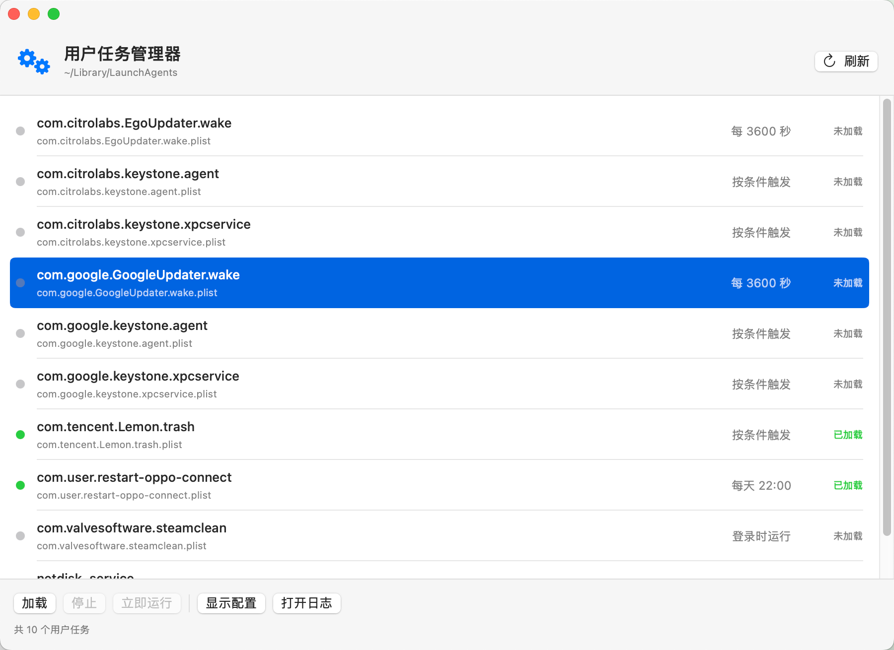
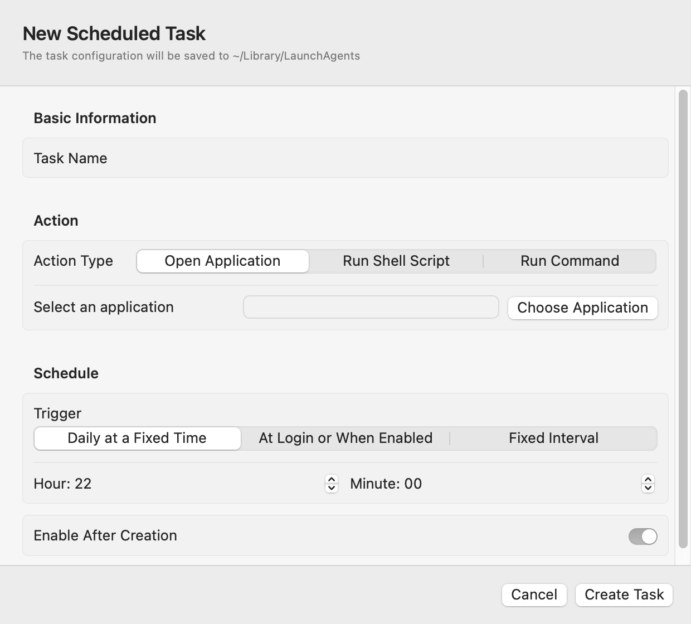

# LaunchAgent Studio

[](LICENSE)

LaunchAgent Studio is a native macOS utility for viewing, enabling, disabling, running, creating, and deleting user-level `launchd` tasks stored in `~/Library/LaunchAgents`.

[Product website](https://launchagentstudio.com/) · [Download the latest release](https://github.com/firzen/launchagent-studio/releases/latest)

For many user-level scheduled jobs, it can be used as a visual, macOS-native alternative to `crontab`. Instead of editing cron expressions manually, you can create `launchd` tasks that run applications, Shell scripts, or commands on a daily schedule, at login, or at a fixed interval.

## Screenshots

### Main Window



### Create a Scheduled Task



## Features

- Lists user LaunchAgents with friendly names and schedules
- Shows enabled tasks first
- Enables, disables, and runs tasks
- Creates tasks that open applications, run Shell scripts, or execute commands
- Supports daily, login, and fixed-interval schedules
- Opens task configuration files and logs
- Moves deleted task files to the Trash
- Supports English and Simplified Chinese
- Uses the system language on first launch
- Checks GitHub Releases for updates and opens the matching download page

## Requirements

- macOS 13 or later
- Xcode Command Line Tools with Swift

## Build

```bash
git clone https://github.com/firzen/launchagent-studio.git
cd launchagent-studio
bash scripts/build.sh
open "dist/LaunchAgent Studio.app"
```

The local build is ad-hoc signed. Public binary releases should be signed with an Apple Developer ID and notarized before distribution.

## Scope

LaunchAgent Studio manages user-level tasks in `~/Library/LaunchAgents`. It does not manage system LaunchDaemons and does not request administrator privileges.

## Safety

- Deleting a task disables it first and moves its configuration file to the Trash.
- Shell commands and scripts run with the current user's permissions.
- Review commands and scripts before creating a task.

## License

LaunchAgent Studio is available under the [MIT License](LICENSE).
